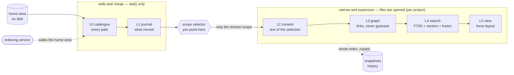

# Morpho-HomeGraph

Metadata over everything, content where you point.

A local index of a home directory that answers questions about your own files:
what is here, what changed, what links to what, and where a phrase appears. It
runs on one machine, stores everything in SQLite, and has no network side.

    morphofiles-graph scan                  # catalogue the home area (L0)
    morphofiles-graph add <dir>             # register a project
    morphofiles-graph update <id>           # build content, graph, index
    morphofiles-graph search "<words>"      # lexical, or --semantic / --fused
    morphofiles-graph view <id>             # a standalone graph page
    morphofiles-graph status [<id>]         # what each layer holds, and its age

## The layers

| | |
|---|---|
| **L0** catalogue | every path in the home area, shared between projects |
| **L1** journal | what moved between two passes: added, changed, touched, ... |
| **L2** content | the text of what a project's scope selected |
| **L3** graph | links between files, stated or derived, never guessed |
| **L4** search | FTS5 lexical, optional vectors, and an opt-in rank fusion |
| **L5** view | morpho's force-layout engine, unchanged, rendering L3 |

`status` reports the age and coverage of each layer, because an index that has
been half-built must not look finished.

## How the layers fit together

**The pinch in the middle is the whole design.** Everything left of the scope
selector is metadata and costs one `stat()` per path: **420 105 entries in
2.02 s warm and 5.36 s cold** — one home area, one i5-9600K, measured
2026-08-04. (A home area moves: the same machine held 729 343 entries before a
deny list, and 588 589 became 448 374 in a single day. Treat the shape as the
claim, not the count.) Everything right of the cut opens files, so it runs only
over what you registered. That is the
sentence at the top of this file, drawn: *metadata over everything, content
where you point.*

The cut deliberately sits **after** L1 rather than before L0. Narrowing earlier
would be cheaper still, but then "what changed in my home area" stops being
answerable, and that is the question the catalogue exists for.

Three diagrams carry the longer version, as typed JSON diagram sources in
`docs/`:

| source | what it shows |
|---|---|
| `docs/arkitektur.architecture.json` | the six layers, in four views: wide, the cut, narrow, history |
| `docs/endringsdeteksjon.workflow.json` | how a change is detected — and the blind spot that is kept on purpose |
| `docs/prosjektets-livslop.lifecycle.json` | a project's life from `add` to retirement |

They are JSON rather than images so a diff shows what changed in the design,
not which pixels moved. Render them with archify; the rendered pages are not
committed, for the same reason the working record is not.

### One blind spot, stated rather than discovered

L1 compares size and mtime before it hashes. A change that preserves **both** is
reported as `unchanged` — that is the price of the cheap layer staying cheap,
and a gate plants the case so the next reader finds it written down instead of
meeting it in the wild. `DECISIONS.md` lists the others.

## Requirements

Python 3.12+, and Node only if you want the semantic layer. `numpy` is the sole
Python dependency. Everything else is the standard library, SQLite and FTS5
included.

    pip install -e .
    npm install        # only for the semantic layer

## Running the checks

    uvx --with numpy --with pytest pytest tests/ -q    # 24 modules of gates
    python3 tests/mutate_cp<n>.py                      # one checkpoint's needles
    bash tools/sweep_all.sh                            # every harness, resumable
    python3 tests/condition_coverage.py                # compound conditions

Two notes for a fresh clone, both measured on one. The semantic gates need
`npm install` first: without it `embed` refuses, and five modules fail on that
refusal rather than on a defect. And `tests/test_no_real_paths.py` is the
publication gate — its last check asserts that the deliberately excluded
working record still exists *locally*, which is false in a clone by design. Run
that one in the working copy, not in a checkout.

The gates are written before the code they grade, and each one has mutations
aimed at it: a green gate that no mutation can turn red is decoration. The full
sweep reports survivors, crashes and misattributions separately, because those
are three different problems.

## Why it looks like this

`DECISIONS.md` carries the design record: the decisions that would otherwise
look arbitrary, the ones a measurement reversed, and the limits that are known
rather than discovered. It also explains the test shape — answer keys written
before the code, mutations aimed at every gate, and why a surviving mutation
has three possible causes.

## Credit

`NOTICE` is the full list, and it is not only a licence formality: the
force-layout engine is morpho's, copied unchanged with a sha256 per file so
that "unchanged" is a check rather than a claim; rank fusion is Cormack, Clarke
and Buettcher (SIGIR 2009); the embedding model is a sentence-transformers
model used through its transformers.js conversion. Three test-harness files
come from a predecessor project by the same author and say so in their own
docstrings, with source commits.

## Licence

MIT, in `LICENSE`. The vendored engine is Apache 2.0, in `LICENSE-APACHE-2.0`.
